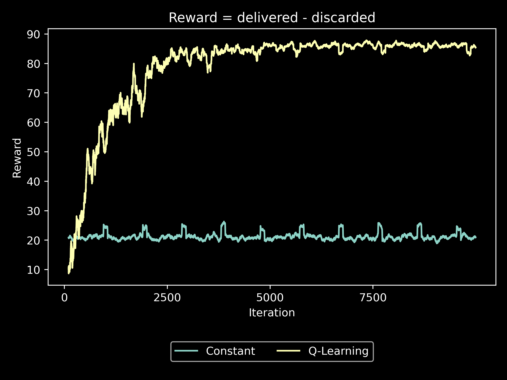

# TimeSeriesPaginationDemo

## Getting Started

The `TimeSeriesPaginationDemo` requires JDK 15 in addition to the [Apache Maven](https://maven.apache.org) build system. The
recommended JDK is the [Zulu OpenJDK by Azul](https://www.azul.com/downloads/zulu-community/?package=jdk).

Use the following commands to build and run the demo:

    mvn clean package
    java -jar target/TimeSeriesPaginationDemo-1.0-SNAPSHOT.jar

This will generate two files:

    results/data/constantStrategy.csv
    results/data/qLearningStrategy.csv

Each file contains two columns, the iteration number and the reward. The reward is defined as:

    reward = delivered - discarded

Where delivered and discarded are determined by the maxmin instant of two interleaving feeds.

The constant strategy is set to naive values of `(100, 100)` for both simulated upstream feeds.

## Plotting Results

After generating the data described above, the performance of both strategies may be plotted together by running:

    python results/plot.py

This will create a plot that looks like the following:

The dependencies for `plot.py` may be installed by creating a Python 3 virtual environment and loading the requirements:

    python3 -m venv ~/demo_venv
    source ~/demo_venv/bin/activate
    pip install -r results/requirements.txt
